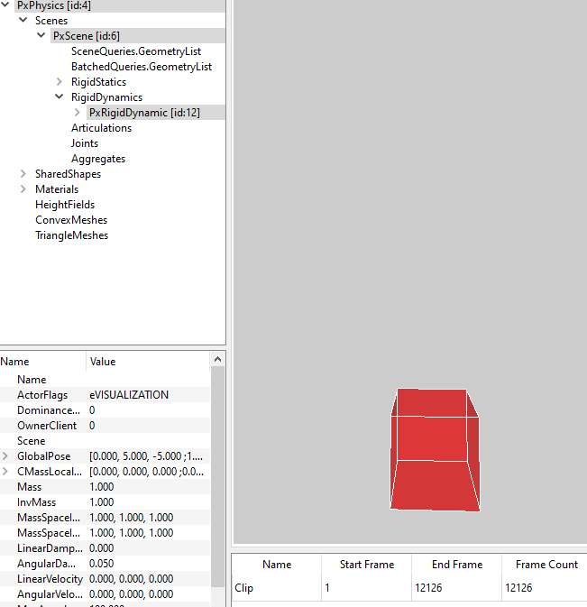
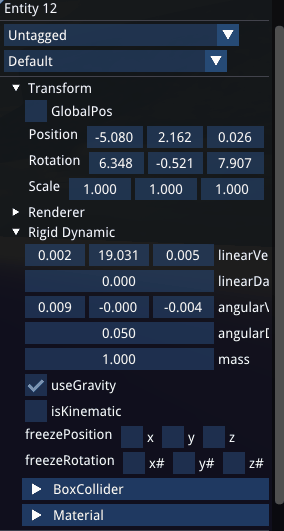
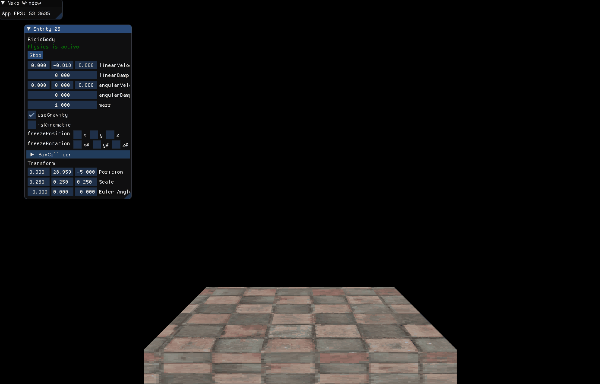
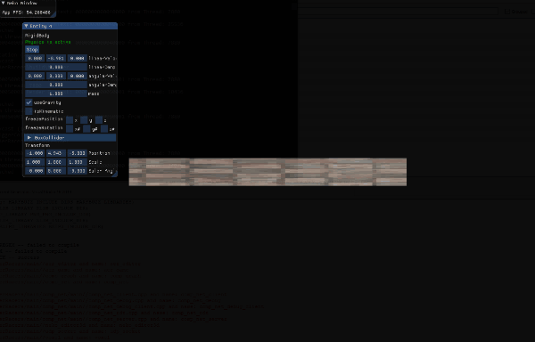
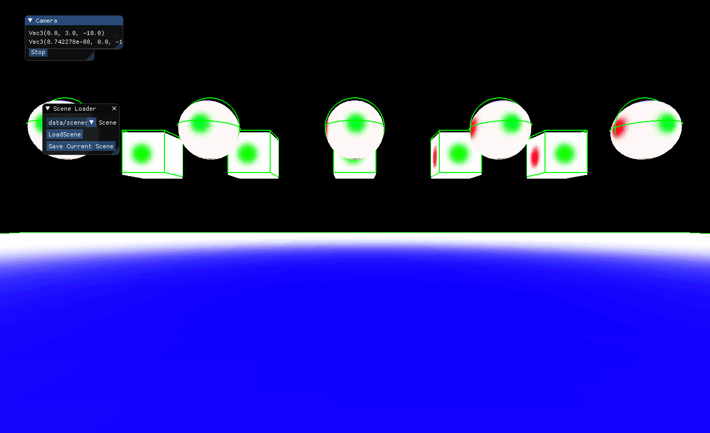
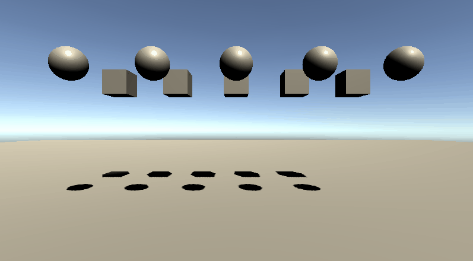

# Blog Integration of PhysX into a C++ Engine

## Introduction
### Context
During my third year of Game Programming at SAE, we were asked to create a game on a custom C++ engine that could be played on the Nintendo Switch. So we develop the AerRacers project which you can find more details on my [post-mortem](https://floreauluca.github.io/aer_racers/blogpost_postmortem).

During this project, we first developed a prototype on Unity to define the needs of the project. Following this prototype, we realized that we would need a physics engine. 

### Problematic
Indeed, as we developed a racing game, we use the Unity physics engine to control speed, manage collisions and perform raycasting to determine how high the ships are.


> Pictures from the prototype

However, as we wanted to be able to import the movements directly from Unity, we had to make sure that the reactions of our engine are compatible with the engine used in Unity.

Therefore we had several possibilities: Create our physics engine, but we had to do it quickly in order not to slow down the game team and we had to be able to import it into Unity or use a third-party library.

After some research on the different physics engines at our disposal, we decided to use PhysX.

## PhysX presentation

PhysX is an open-source library developed by Nvidia and used in many programs or games like Unity,...

This choice was made because of several advantages of this library:
- First of all, the compatibility with Unity: indeed as PhysX is the engine of Unity we did not need to change the engine for the prototype.
- Then, PhysX is an open-source engine, so we could access the code freely if we needed it.
- Finally, PhysX being an Nvidia library, the integration to the Nintendo Switch was greatly facilitated.

## Integration with CMake

The first step for the integration of PhysX in the game engine was to integrate it into the visual studio project. For this, we used CMake because it is the tool used to manage the other libraries.

By chance, the PhysX library has a CMake List already in place.

However, I have spent a lot of time editing the CMake files of the PhysX library, either to fix bugs or to adapt the implementation to our project.

This task helped me to realize how long it can take to integrate a library in CMake, even if a CMakeList is already present.

But it also allowed me to better understand how libraries work and how to integrate them with CMake.

## Initialization of PhysX

Once the library was integrated with CMake, I still had to integrate the engine into the project. 

For that, I created a wrapper allowing to link the engine and PhysX.

The first step was the initialization of all the PhysX modules.

The first module is PxFoundation allowing the initialization of the other modules.

Then we initialized PxPvd which allowed us to use PhysX Visual Debugger. It is a tool allowing us to visualize the physical elements in real-time. It was particularly useful to check that the elements displayed correspond to the simulated physical elements.



> PhysX Visual Debugger

The next module is the creation of the PxPhysic.

And the last module is the initialization of the PxCooking which allowed us to create the collider meshes.

The next step consists of the creation and definition of the parameters of the scene.

It is here that we specified that we use continuous collision detection allowing us to have no problem during a high-speed collision.

Finally, the last step is the call of the FixedUpdate function. For this, we used the Update function and added an accumulator to trigger the FixedUpdate only when the accumulator is greater than the step size.
Moreover, I added a simulation of several steps per frame so that there is no physical slowdown in case of graphical slowdown.

```cpp

bool PhysicsEngine::Advance(physx::PxReal dt)
{
    accumulator_ += dt;
    if (accumulator_ < stepSize_.count())
        return false;

    return true;
}

void PhysicsEngine::Update(seconds dt)
{
    if (Advance(dt.count())) {
        if (accumulator_ > 1.0f)
        {
            while (accumulator_ > 1.0f) {
                accumulator_ -= stepSize_.count();
                FixedUpdate(stepSize_);
            }
        }
        else {
            accumulator_ -= stepSize_.count();
            FixedUpdate(stepSize_);
        }
    }
}

```

Finally, during the FixedUpdate, I first simulated the physics then called all the FixedUpdate functions. For that, I used a listener allowing a class to inherit the FixedUpdateListener and to be able to use the FixedUpdate function called at the right time. This was necessary to avoid applying several times a force before a simulation.

```cpp
void PhysicsEngine::FixedUpdate(seconds dt)
{
    scene_->collide(dt.count());
    scene_->fetchCollision(true);
    scene_->advance();    // Can this be skipped
    scene_->fetchResults(true);
    fixedUpdateAction_.Execute(dt);
}
class FixedUpdateInterface
{
public:
    virtual void FixedUpdate(seconds dt) = 0;
};
```

## Creation of the RigidActorManager

Once the physics engine was set up, we still had to link the creation of physical elements to the ECS (Entity Component System).

In the ECS, the components represent the parameters of an entity. So, to add physical parameters to an entity, I had to create a physical component.

Each physical component is composed of a RigidActor containing the parameters controlling the movements of the entity. Each RigidActor contains Colliders, which are the collision zones of the RigidActor. And each Collider contains a PhysicsMaterial, containing the reaction parameters of the collider (bounce, friction,...) 

However, in our project, we use two types of RigidActor, the static immobile RigidActor, and the dynamic RigidActor. In addition, we use 4 types of colliders: boxes, spheres, capsules, and meshes.

 <!--TODO-->
> Diagram of a Rigid Actor

So, we had to be able to initialize each RigidActor with the different possible colliders and all the parameters. 

My first decision was to separate the RigidStatic and RigidDynamic into two components as they define different behaviors and only the RigidDynamic needed to be updated with each fixed update.

To initialize the RigidActor, I decided to use RigidActorData. These are structures containing all the parameters of the possible colliders of the RigidActor as well as the parameters of the Physics Material. The RigidDynamicData inherits from the RigidActorData but contains, in addition, the parameters of the RigidDynamic.

 <!--TODO-->
> UML of RigidActorData

Once this information is retrieved, I first create the PxShape corresponding to the Collider and PhysicsMaterial information. As our project does not require several Colliders per RigidActor, I initialize only one collider per RigidActor.

Then I create the RigidActor by giving it the right parameters and the created PxShape. 

To avoid keeping useless information in the ECS, I only keep the pointer to the PxRigidActor, the PxShape, and the PxMaterial. I also add functions to retrieve and modify all the information of the PxRigiActor.
```cpp
struct RigidActor
{
public:
	[[nodiscard]] physx::PxShape* GetPxShape() const { return shape_; }
	[[nodiscard]] physx::PxMaterial* GetPxMaterial() const { return material_; }
	[[nodiscard]] ColliderType GetColliderType() const;
	[[nodiscard]] SphereColliderData GetSphereColliderData() const;
	[[nodiscard]] BoxColliderData GetBoxColliderData() const;
	[[nodiscard]] CapsuleColliderData GetCapsuleColliderData() const;
	[[nodiscard]] PhysicsMaterial GetPhysicsMaterial() const;
	void SetSphereColliderData(const SphereColliderData& sphereColliderData) const;
	void SetBoxColliderData(const BoxColliderData& boxColliderData) const;
	void SetCapsuleColliderData(const CapsuleColliderData& capsuleColliderData) const;
	void SetMeshColliderData(const MeshColliderData& meshColliderData) const;
	void SetMaterial(const PhysicsMaterial& physicsMaterial) const;

protected:
	physx::PxMaterial* material_ = nullptr;
	physx::PxShape* shape_       = nullptr;
};
```

However, as this information cannot be read at the same time as it is modified by physics, it must be retrieved in the FixedUpdate. Therefore, I had a problem when I wanted to display them in the editor for each frame. For that, and as the editor displays only one entity at a time, I save in the ComponentViewer the RigidActorData displayed and I update it at each FixedUpdate.



> RigidDynamic Inspector

```cpp
class RigidDynamicViewer final : public ComponentViewer,
								 public FixedUpdateInterface
{
public:
	RigidDynamicViewer(
		PhysicsEngine& physicsEngine,
		RigidDynamicManager& rigidDynamicManager);

	void SetSelectedEntity(Entity selectedEntity);

	void FixedUpdate(seconds dt) override;

	void DrawImGui(Entity entity) override;

protected:
	PhysicsEngine& physicsEngine_;
	RigidDynamicManager& rigidDynamicManager_;

	Entity selectedEntity_     = INVALID_ENTITY;
	Entity lastSelectedEntity_ = INVALID_ENTITY;

	DynamicData dynamicData_;
	RigidDynamicData rigidDynamicData_;
};
```

Finally, the information is recovered via the RigidDynamicManager and the RigidStaticManager thanks to the RigidActorData structure. However, to avoid recovering all the information each time, I created a DynamicData allowing to recover only the linear and angular speed.
```cpp
struct DynamicData
{
	Vec3f linearVelocity  = Vec3f::zero;
	Vec3f angularVelocity = Vec3f::zero;
};
```

## Added functionality

In addition to the RigidDynamicManager and RigidActorManager, the game needed some extra functionality.

### Raycast

The raycast system is calculated directly from the physics engine. It returns all information used by the game.
```cpp
struct RaycastInfo {
public:
    bool touch = false;
    Vec3f GetPoint() const;
    Vec3f GetNormal() const;
    unsigned GetFaceId() const;
    float GetDistance() const;
    Vec2f GetUv() const;
    physx::PxRaycastBuffer pxRaycastBuffer;
};
```

However the game also needed to filter a certain type of component, so I added a filter on the raycast and a type of filter in the RigidActorData. 

### Contact detection

The collision detection system allows to detect of a collision with a wall and also adds some force to unblock the ship. For that, I first added in the description of the scene a ContactReportShader and a PhysicsSimultationEventCallback. Then when the contact was detected in the PhysicsSimulationEventCallback, I used the listener system allowing the classes needing the ContactEnter to inherit the ContactInterface.  

```cpp
class OnCollisionInterface
{
public:
    virtual void OnCollisionEnter(const physx::PxContactPairHeader& pairHeader) {};
    virtual void OnCollisionStay(const physx::PxContactPairHeader& pairHeader) {};
    virtual void OnCollisionExit(const physx::PxContactPairHeader& pairHeader) {};
};

class OnTriggerInterface
{
public:
	virtual void OnTriggerEnter(physx::PxTriggerPair* pairs) {};
	virtual void OnTriggerExit(physx::PxTriggerPair* pairs) {};
};
```

### MeshCollider

Finally, I had to set up the creation of a mesh collider allowing better precision with the ground. For that, it was necessary first to check that the mesh is loaded to create the RigidStatic as the mesh collider is used only for the static objects. Once loaded, I created a shape for each mesh. Finally, to create the mesh collider, I get the vertices and the indices of the mesh and I send them to the PxCooking so that it creates a PxTriangleMesh. 

One of the problems I encountered was the size of the triangles. Since the terrain is large, it was impossible to generate a mesh collider with such large triangles. Therefore, I reduced the size of the model and rescaled the entity only after creating the mesh collider.

### Integration in the SceneManager

Finally, I needed to export the physical components from Unity. Therefore, using the scene exporter, I decided to organize the export according to the structure in Neko. So each RigidBody has all the Collider types but with only one defined. And since there is no RigidStatic in Unity, I create a RigidStatic each time there is a collider without RigidBody.
```cpp
[Serializable]
public class RigidbodyData
{
    public bool exist = false;
    public bool useGravity;
    public bool isKinematic;
    public bool isStatic = true;
    public float mass;
    public float linearDamping;
    public float angularDamping;
    public Bool3 rotationLock;
    public Bool3 positionLock;
    public BoxColliderData boxCollider = new BoxColliderData();
    public SphereColliderData sphereCollider = new SphereColliderData();
    public CapsuleColliderData capsuleCollider = new CapsuleColliderData();
    public PhysicsMaterialData physicsMaterial = new PhysicsMaterialData();
}
```

## Conclusion

### Final result

Thus, the engine on Neko allows to 
- create RigidActor static or dynamic
- create a box, sphere, capsule, or mesh collider
- launch raycasts on specific objects
- detect collision between two objects
- import components from Unity
- 




> Tests of the physics engine




> Comparaison Unity and Neko

 <!--TODO-->
> Result in game

### Go further

I only implemented the functions that were necessary for our project, however, PhysX has many extra features like articulations or GPU optimization.

### What I learned

The integration of this physics engine has first of all taught me to better master the libraries and the integration of libraries in a CMake project.

Moreover, I also learned to better organize my files and my classes to make things more readable.

Finally, I also learned not to generalize everything but to do only the things necessary for the good progress of the project.

### What I would do differently

As I learned a lot about file organization, I would reorganize them differently. I also think it would have been more interesting to make a single component for RigidDynamic and RigidStatic to avoid duplicating the same code.

### Source
https://gameworksdocs.nvidia.com/PhysX/4.1/documentation/physxguide/Manual/BuildingWithPhysX.html 
