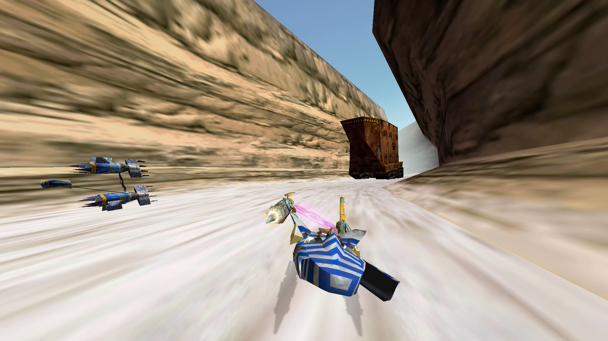
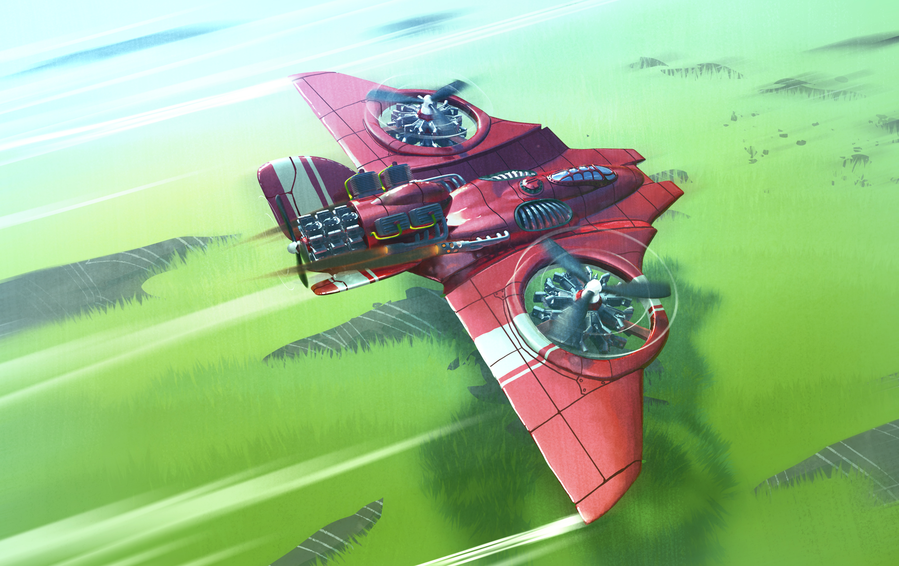
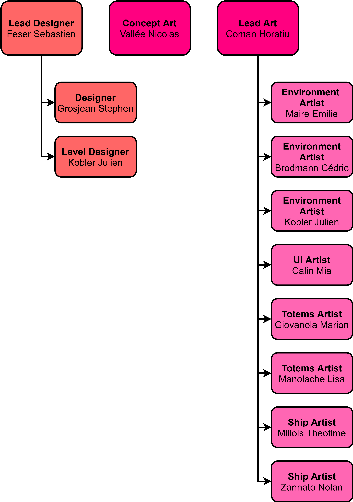
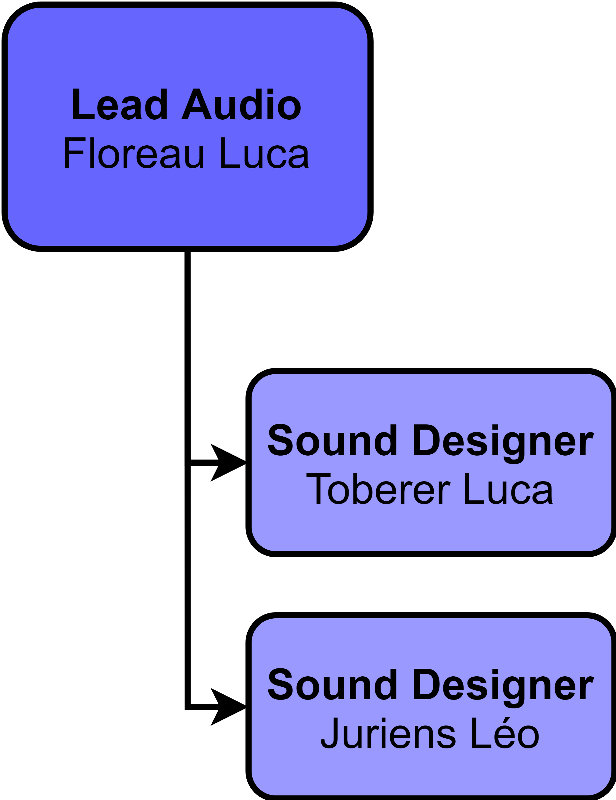
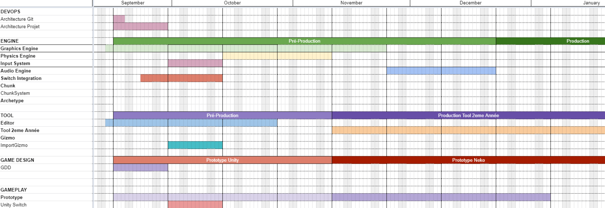
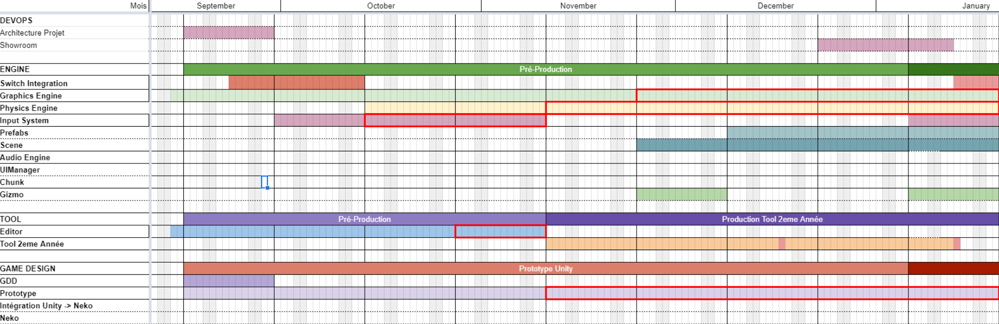
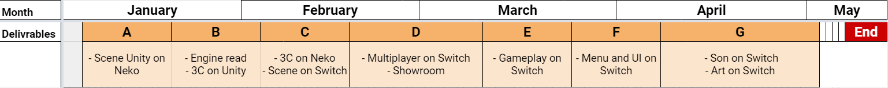
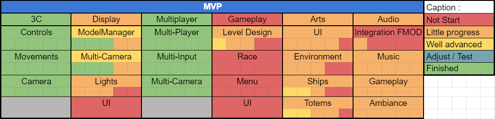
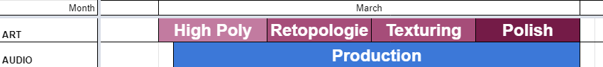
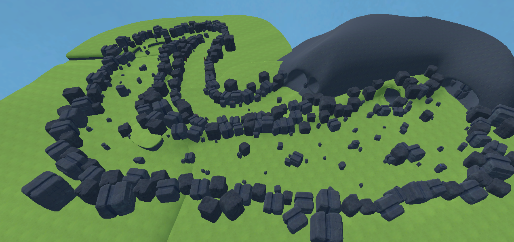

# Blog Post Mortem of the AerRacers Project

## Introduction

### Context

During my third year of Bachelor in Game Programming at the SAE Institute, we had objectives to set up a specialization project aiming to put into practice what we had learned and to develop our skills in the fields of our future jobs.

### Instructions

This project took place over 8 months from September to April 2021.

Our project was to create a racing game on Switch in local multiplayer.

For this, we had to use the [NekoEngine](https://github.com/EliasFarhan/NekoEngine/tree/develop), a custom game engine developed in C++ by Elias Farhan. It is an engine based on the ECS system. It uses the OpenGL, SDL2, and EasyProfiler libraries.

### Team

For the implementation of the project we were 5 programmers: 
- Sebastien Feser, Project Leader, Lead Designer, and Lead Game, 
- Stephen Grosjean Dev Ops, 
- Simon Canas Lead Engine Prog 
- Dylan Von Arx Lead Tool who left in January
- me, Luca Floreau, Producer and Lead Programmer

### My Roles

As Producer, I was in charge of the planning.

As Lead Programmer, I was in charge of the distribution and the progress of the tasks.

Finally, I also took care of the Engine and Game tasks according to the needs of each team.

## Project

So we decided to start on a pod racing game inspired by Star Wars Pod Racer. 

> Star Wars Pod Racer

For the artistic direction, we received concept arts from Nicolas Vallee inspired by Porco Rosso. However, following a lack of communication of our art, we have some misunderstandings concerning the concept art produced.

> Concept Arts

During the production, we welcomed several teams to help us.

First of all, we welcomed the second-year Games Programmer as part of their Tool Production modules. They produced tools on Unity and Neko to help us in the production of our project.

> Tools Hierarchy

Next, we welcomed the second-year Game Artist for the production of graphic models. They used Nicolas Vallee's concept art to produce the environment, the ships, and the totems.

> Art Hierarchy

We also welcomed the second-year Audio Designer for the production of the sound effects. We also used the production of Leo for the music of the game.

> Audio Hierarchy

## Pre-production

The pre-production started mid-September with the presentation of the instructions

My first task as a producer was to divide, plan and distribute the tasks until December. 

> Planification in September

For this, I was inspired by the documents put in place during the PokProject of the third-year student last year.

So, I first set up milestones representing the main production steps.

However, as it was the first time we worked on a project of this size, the definition of the tasks was risky and many tasks were badly defined, planned, or even forgotten.

In parallel, I also set up different organizational tools: 
- Trello for the distribution and progress of tasks, 
- Drive for technical and administrative documentation and assets.

In parallel, the DevOps took care of setting up and prioritizing the git.

The Design team set up the rules and objectives of the game and the Game team has created a prototype on Unity to define the movements of the ship and the camera.

The Tool team is in charge of setting up a working environment for the creation of the second-year student's tools.

The Engine team took care of the structure of the Visual Studio project. Then, Simon took care of the implementation of a Vulkan engine while I took care of the detection of the inputs and the implementation of the physical engine

In parallel, we also took in hand the use of the development kit of the Nintendo Switch.

## Planning Failure

Arrived in December, the project had not progressed as planned.

Almost all the teams were behind schedule and the tasks were stuck on a task.

 

> Planification in December

For my part, I was stuck on the physics engine

As a result, our teacher talked to us about it and we had the chance to have Sylvain Cardin who gave us a course on project management to put our project in order.

## Replanification

So at the beginning of the Christmas vacations, thanks to his advice and the techniques he told us about, we were able to set up a more solid planning and task management system.

First, we set up a system of deliverables, requiring us to produce certain tasks by a certain date. 
This allowed us to have shorter-term goals that were easier to achieve.

 

> Deliverables

Secondly, in addition to the tasks, we set up subtasks, allowing us to better define the tasks and to fit the tasks into the duration of a sprint.

Finally, Elias advised us to organize the tasks according to the MVP, allowing us to avoid unnecessary tasks and to see the progress of the game.

> MVP Grid

## Importation in Neko

So the first objective at the beginning of the year was to set up the transition between Unity and Neko. 

On the Engine side, I was in charge of finishing the physics engine and creating the scene import for Neko.

On the Game side, as Lead Programmer, I help the Game team to finish their tasks and I helped them to take in hand the Neko Engine.

## The arrival of the artists

After the import in NekoEngine, we welcomed the graphic and audio artists.

So I took care of defining the deadlines for the assets so that the Lead Artist could define the production milestones.

> Artist Planification

We also followed the production of the arts to answer their questions and give them feedback.

Unfortunately, because we didn't pay enough attention to the assets and the references we were asking for, we realize now that some assets could have been designed differently. 

A few weeks later we also welcomed the audios. 

Unfortunately, the production of the music could not be finished due to the absence of a team member and therefore we used music previously produced by Leo Jurien.

Also, time did not allow us to redo the audio assets, so some of the assets may not be exactly what we had in mind.

In parallel, we also asked the artists to help us with the level design. 

Indeed, as we didn't know exactly how to reconcile adaptable level design and a fluid terrain, we directly gave the responsibility of the game design to the artists. 

> Level Design

However, I regret that we didn't take enough time to give feedback on the level design which could have been done differently to avoid game design confusion.

## MVP

Following the import from Neko, we began the production of the gameplay elements for the MVP.

Thanks to the planning according to the objective, we were able to concentrate on the gameplay elements necessary for the production.

Moreover, thanks to the weekly task check, we were able to detect the delays and implement a rectification of the schedule.

Therefore, for the Game team, I was in charge of the implementation of the multiplayer and for the Engine team, I set up the UiManager.

## Polish

Finally, in the last phase of production, we still had many tasks on the engine and game side. Therefore, we had to cancel the use of the Vulkan Engine in the project and optimize the OpenGL engine. We also had to cancel some features that didn't have time to be produced for the project.

## Conclusion
### Final rendering

Finally, the AerRacers project could be finished in time. It is available [here]().

> Pictures of the game

### Final opinion

For my part, I am quite happy with the final rendering of the project.  

I am also very happy that the replanification of January went well and that it helped us to the success of the project. I'm also happy that the team is also happy with the replanning.

It also allowed me to have a more concrete point of view of what is the production of a game and how it happens in the work of a programmer.

Following the game, we were able to ask for external professional feedback on the subject. 
We had feedback on the technical choices that were approved.

We were also able to test the game with individuals. 
So we had some feedback on elements of game design that could be improved, such as understanding the direction of the road or some controls that can be hazardous.

Finally, we do not want to continue the production of the game. It was a good experience but none of the team members want to push the concept of the game further.

### What I learned

However, this project allowed me to learn several lessons that I suppose will be useful in the future.

First of all, this project allowed me to become aware of the importance of good planning and documentation on the progress of a project but also of the time that it takes to set up. Indeed, the replanning in deliverables allowed us to advance more efficiently on our project.

Moreover, it is also important to keep an eye on the objective. As I said before, this allowed us to better plan the tasks and avoid tasks that are not necessary to produce the goal. It is also a good way to show the team the importance and usefulness of their work.

I noticed that it is important to follow the progress of everyone because it allows to better understand the difficulties of some tasks, but also to redirect if some tasks are not necessary. 

Finally, I also learned a lot about teamwork and especially how to interact with artists and what they need to work. 

But I also learned many more technical skills.

First of all about the organization of a game engine and the implementation of libraries in it.

Moreover, I learned the implementation of many systems like input management or file management...

In parallel, I also learned how to use a development kit for a console (the Nintendo Switch).

## Thanks
### External thanks
- Nicolas Schneider
- Amandine Coget
- Sylvain Cardin
- Chris Wulf
- Unofficial testers
### Thanks to the teachers
- Elias Farhan
- Nicolas Siorak
- Frederick Dubouchet
- Nicolas Vallee
### Thanks to the team
- Tools team
- Art team
- Audio Team
### Thanks to the Lead
- Sebastien
- Simon
- Stephen