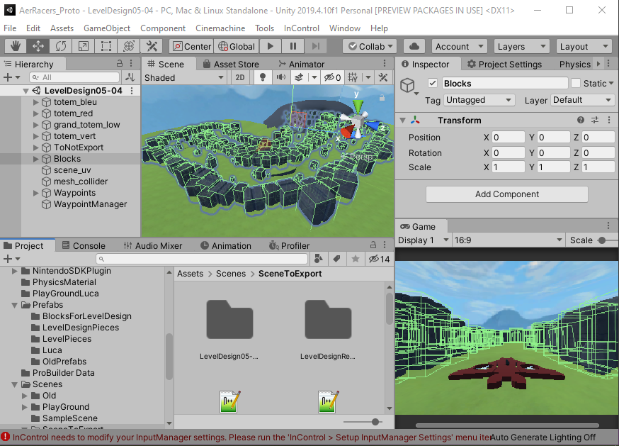

# Blog Import Unity Scene into Engine C++

## Introduction

### Context

During my third year of Game Programming at SAE, we were asked to create a game on a custom C++ engine that could be played on the Nintendo Switch. So we develop the AerRacers project which you can find more details on my [post-mortem](https://floreauluca.github.io/aer_racers/blogpost_postmortem).

During this project, we decided to use Unity to design the level. For this, we had to set up a scene system that could be imported from Unity. 

### Problematic

We chose to implement the level design on Unity because it allowed us to use the Unity editor tools without having to recreate them in the NekoEngine.

> Editor in Unity
