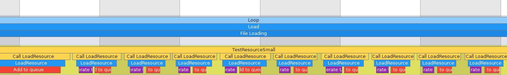
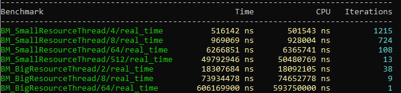

# Blog Seperate Thread Resource Manager
## I. Introduction
I worked on the implementation of a resource manager for a game engine developed in C++.
        The purpose of the Resource Manager is to load the needed files for the conception of the game (scene, prefabs, materials, ...).
        Therefore, it contained a map ordering resource with a ResourceID.
        The ResourceID used is a UUIDv4, a unique index coded in 128 bits generate randomly. This ResourceID allows users to get a resource much time.
        The Resources are BufferFile, which it's a char\* and its size and an integrated loading function.
		
```cpp
//ResourceID and BufferFile
```
For the game engine, we use a Separate Thread Resource Manager. It's a Resource Manager working a thread parallel to the main thread.
        This technique allows a big optimization because it allows loading files without interrupt game thread.
    


        Indeed, loading resources is quite a long operation because it requires access to memory.
        However, the difficulty with multithreading is to access the same variable with two threads.

A class Separate Thread Resource Manager is composed of 6 critic members :
- status_ : which allows knowing the status of the resource Manager (Empty, Waiting,...)
- idQueue_ : which is the queue of ResourceID needed to be load
- resourcePromise_ : which is a map using ResourceID as key and contain resources information (resources, path, ready)
		
		These members are used by 4 functions on different threads :
		Calling from main thread :
- LoadResource : a function asking the path of the resource and return the ResourceID allowing to get the resource
- IsResourceReady : function allowing to know if a resource is loaded
- GetResource : function allowing to get a resource from a ResourceID when it loaded
		Calling from the parallel thread :
- LoadingLoop : a loop which loads resources

So, the critical sections can be represented by the diagram below :


To prevent threads from interacting with the same values at the same time, we need to block threads for each use. The objective is then to block members as little as possible.

## II. LoadResource

The function LoadResource is composed of 5 actions :
1. Add a LoadPromise for the future resource
2. Add a new ResourceID at the end of the queue
3. Notify the threads that a ResourceID has been added
4. Set the status to not empty
5. Return the ResourceID

        So parts 1, 2 and 5 need access to critical members.
        However, the first optimization is to past the status_ to atomic. Indeed, atomic is a parameter allowing CPU to access and modify a value at the same time. Therefore, the modification of the status bitflag not need to be locked.
        Furthermore, I remarked that the creation of a new UUID can take a lot of time. That why I separate it from the push to the queue and took it out of the critical section.
        So, only actions 1 and 3 needed to lock other threads.




## III. IsResourceReady & GetResource

The function IsResourceReady search if a resource is ready and the function GetResource will retrieve a resource by its ID.
        Firstly, I create a resource only when it's ready. However, that implies that I do a find which will go through the whole map to check if the ID exists. That why I decided to create a struct LoadPromise which knows if the resource is ready.
        **Picture of the structure**
        **Picture showing optimization**


## IV. LoadingLoop 

		This is a loop that will check if the queue is empty. If it's true, it will pause the thread notified. If the queue is not empty, it will do these 4 actions :
1. Get the first ResourceID of the queue
2. Erase this ResourceID from the queue
3. Load the resource of the path register
4. Set the resource as ready

As seen earlier, the loop can access the status_ without needed to be locked. To check if the queue is empty, I preferred to register it in the status_ avoiding to lock the threads.
        As seen at the start, the longest part is the loading. So, I can't let the actions 3 in the critical section. That's why I get the struct, unlock threads, load and modify ready, and lock again to set the promise in the map.
        


##  V. Conclusion





		To conclude, the important part of my optimization was to reduce the critical section.


```cpp
struct Quaternion
{
  float x;        //4 bytes
  float y;        //4 bytes
  float z;        //4 bytes
  float w;        //4 bytes
};
```

<!--- Show in code the implementation --->

The *Quaternion* contains 4 *floats* representing every values.

For the optimization I implemented, I decided to take the **Dot** function that calculates the Dot Product of 2 *Quaternions*, as a reference to test if it was working or not.

So here’s how the **Dot** function of my *Quaternion* struct looks like:
```cpp
static float Dot(Quaternion a, Quaternion b)
{
  return  a.x * b.x +
          a.y * b.y +
          a.z * b.z +
          a.w * b.w;
}
```

The **Dot** function takes each value of the *Quaternion a* and the *Quaternion b* to calculate the Dot product and it returns a *float*.

These are the most logical way someone would implement a Quaternion and a Dot Product. Now, let’s look at how I decided to optimize this calculus.

## FourQuaternion
To optimize my code, I decided to create a new Struct called *FourQuaternion*. The idea here is that this structure will contain 4 *Quaternions* instead of one.

Why am I doing that? Because instead of doing the calculus 4 times with a different *Quaternion*, I’ll be doing it only once by aligning each values of the Quaternions.

Why 4 floats then? Because 4 floats uses 4 bytes each and an xmm register can contain 16 bytes.

The *FourQuaternion* structure looks like this:

```cpp
struct FourQuaternion
{
  std::array<float, 4> x;       //16 bytes
  std::array<float, 4> y;       //16 bytes
  std::array<float, 4> z;       //16 bytes
  std::array<float, 4> w;       //16 bytes
};
```
<!--- Show in code the implementation --->

It contains an array of 4 *floats* for each values in the *FourQuaternion*.

## Array of Structures of Arrays
I've decided to approach the problem by creating an AoSoA system.

To stock the values of my *FourQuaternions*, I decided to use Array of Structure of arrays.
<!--- explain more about AoS SoA and AoSoA --->
Structure of arrays is a layout separating elements of a structure into one parallel array per field. It makes it easier to use them by packing them into SIMD instructions. So I must create those first.


The reason why structures of arrays are better here is because the values will be aligned in code so it's much faster to load all values from memory in one block instead of going for each value and then aligning them.

- **Aos Alignment:** xyzwxyzwxyzwxyzw
- **SoA Alignment:** xxxxyyyyzzzzwwww

Every FourQuaternions will be stocked in an Array in the code, this is then an Array of Structures.

So combining these two values, it creates an Array of Structures of Array.

This is how I decided to implement my AoSoA:


## Intel Intrinsics
To do the functions with these arrays, I’ll have to use the Intel intrinsic instructions, which are C style functions that provide access to many Intel instructions without the need to write assembly code. 

Since I decided to use the **Dot** function as a test, let’s look at how it looks like in the *FourQuaternion*:
```cpp
static inline std::array<float, 4> Dot(FourQuaternion q1, FourQuaternion q2)
	{
		alignas(4 * sizeof(float)) std::array<float, 4> result;
		auto x1 = _mm_load_ps(q1.x.data());
		auto y1 = _mm_load_ps(q1.y.data());
		auto z1 = _mm_load_ps(q1.z.data());
		auto w1 = _mm_load_ps(q1.w.data());

		auto x2 = _mm_load_ps(q2.x.data());
		auto y2 = _mm_load_ps(q2.y.data());
		auto z2 = _mm_load_ps(q2.z.data());
		auto w2 = _mm_load_ps(q2.w.data());

		x1 = _mm_mul_ps(x1, x2);
		y1 = _mm_mul_ps(y1, y2);
		z1 = _mm_mul_ps(z1, z2);
		w1 = _mm_mul_ps(w1, w2);

		x1 = _mm_add_ps(x1, y1);
		z1 = _mm_add_ps(z1, w1);
		x1 = _mm_add_ps(x1, z1);
		_mm_store_ps(result.data(), x1);
		return result;
	}
```
<!--- Show in code the implementation --->

Let me explain what the Intel Intrinsics function do:
### ps
ps means packed single_precision floating-points. It basically means 4 * 32 bit floating point numbers stored as a 128-bit value.

### _mm_load_ps()
The **_mm_load_ps** function is loading from memory the values contained in the array. The values must be 16 bytes which correspond to an *array* of 4 *float* numbers, and they must be aligned in memory, that’s why we’re using arrays that align the *floats* in memory.

### _mm_mul_ps()
The  **_mm_mul_ps** function is multiplying 4 *floats* with 4 other *floats*.

### _mm_add_ps()
The **_mm_add_ps** function is adding two values together.

### _mm_store_ps()
The **_mm_store_ps** function is storing from the value *x1* to the memory.

Here, instead of calculating the functions 4 times with 4 different Quaternions, I’ll be calculating them only once. This will allow to spare a lot of performance as I will show you.

## Performances
I created a test that calculated the **Dot product** of *n* quaternions using the MSVC compiler with an intel core i7 CPU on a Windows 10 PC. Here’s the result:

<!--- Show a graphic of the code --->


As you can see, the **BM_Dot_Intrinsics** is between 3 and 4 times faster than the **BM_Dot** which is a huge performance optimization.

## Lessons Learned
It was the first time for me to do that kind of exercise to optimize the most I could the code I implemented.

It was the first time I worked with AoSoAs and with the Intel Intrinsics functions. It was really interesting to know what was going with the compiler and what it was doing to try to optimize the code I was writing, and knowing that he couldn't guess everything.

I hope you had fun reading my Blogpost and that you learned something out of it :)
<!--- Conclusion --->
