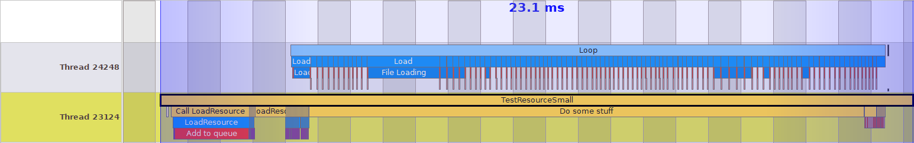

# Blog Separate Thread Resource Manager
## Introduction
I’m currently in a Games Programming formation and, during my second year of study, my classmates and I have different tasks to implement for a Game Engine in C++.
One of my tasks was to implement a separate thread resource manager.
The purpose of the resource manager is to load files to use them for the game, which can be materials, shaders, saved data,...

All these files will be stocked in a map ordering these resources using a **ResourceID** such as a key. The users will then use this key to access the wanted file.


The **ResourceID** used is a UUIDv4, a unique index coded in 128 bits generates randomly, and the resources are **BufferFile**, which it's a char\* and its size and an integrated loading function.
		
```cpp
using ResourceId = sole::uuid;
using Path = std::string_view;

struct LoadPromise {
    BufferFile resource;
    Path path = "";
    bool ready = false;
    LoadPromise(Path newPath) : path(newPath) {}
    LoadPromise() {}
};
struct BufferFile
{
    char* dataBuffer = nullptr;
    size_t dataLength = 0;

    void Load(std::string_view path);
    void Destroy();

    bool operator==(const BufferFile& bufferFile) const;

};
```

## Separate Thread Resource Manager

For our game engine, we use a **Separate Thread Resource Manager**. It's a resource manager working on a thread parallel to the main thread.
This technique allows a big optimization because it allows loading files on a different thread without interrupting the game thread.
    


Indeed, loading resources is quite a long operation because it requires to have access to memory.

But the difficulty with multi-threading is to access the same members with two threads. The members called by different threads are called critical members and the section using thus members are called critical sections.

A class **Separate Thread Resource Manager** is composed of 3 critical members :
- **status_** : which allows knowing the status of the resource manager (Empty, Waiting,...)
- **idQueue_** : which is the queue of **ResourceID** needed to be loaded
- **resourcePromise_** : which is a map using **ResourceID** as key and contain resources information (resources, path, ready)

```cpp
private:
    std::unordered_map<ResourceId, LoadPromise> resourcePromises_;
    std::vector<ResourceId> idQueue_;
    std::atomic<std::uint8_t> status_;
    enum ResourceManagerStatus : std::uint8_t
    {
        IS_RUNNING = 1 << 1, //To check if the ResourceManager is running
        IS_NOT_EMPTY = 1 << 2, //To check if the ResourceManager has no tasks
    };
```
These members are used by 4 functions on different threads :
Calling from the main thread :
- **LoadResource** : a function asking the path of the resource and return the **ResourceID** allowing to get the resource
- **IsResourceReady** : a function allowing to know if a resource is loaded
- **GetResource** : a function allowing to get a resource from a **ResourceID** when it loaded

```cpp
public:
    bool IsResourceReady(const ResourceId resourceId);
    neko::BufferFile GetResource(const ResourceId resourceId);
    ResourceId LoadResource(const Path assetPath);
```
Calling from the loading thread :
- **LoadingLoop** : a loop which loads resources

```cpp
private:
    void LoadingLoop();
```

So, the critical sections can be represented by the diagram below :


As you can see both threads must access the same values.
To prevent threads from interacting with the same values at the same time, we need to block the threads for each use. The objective is then to block members as little as possible.
We will see how, for each function, I optimize the critical sections to minimize them.

### I. LoadResource

The function **LoadResource** is composed of 5 actions :
1. Add a **LoadPromise** for the future resource
2. Add a new **ResourceID** at the end of the **isQueue**
3. Notify threads that a **ResourceID** has been added
4. Set the **status** to not empty
5. Return the **ResourceID**

So parts 1, 2 and 4 need to have access to critical members.
However, the first optimization is to transform the **status** in an **atomic**. Indeed, **atomic** is a parameter allowing the CPU to access and modify a value at the same time. Therefore, the modification of the **status** does not need to lock other threads.
Furthermore, I noted that the creation of a new UUID can take a lot of time. That's why I separate its creation from the push to the queue and took it out of the critical section.
So, only actions 1 and 4 needed to lock other threads.

```cpp

neko::ResourceId neko::ResourceManager::LoadResource(const Path assetPath)
{
    const ResourceId resourceId = sole::uuid4();
    {
        const std::lock_guard<std::mutex> lockGuard(loadingMutex_);
        idQueue_.push_back(resourceId);
        resourcePromises_[resourceId] = LoadPromise(assetPath);
    }
    status_ |= IS_NOT_EMPTY;
    cv_.notify_all();
    return resourceId;
}

```

## II. IsResourceReady & GetResource

The function **IsResourceReady** searches if a resource is ready and the function **GetResource** will retrieve a resource by its **ResourceID**.
Firstly, I create a resource only when it's ready. However, that implies that I do a **find** which will go through the whole map to check if the **ResourceID** exists. That's why I decided to create a **struct LoadPromise** which knows if the resource is ready.


As you can see, the **find** is twice as long as the **ready**

```cpp
bool neko::ResourceManager::IsResourceReady(const ResourceId resourceId)
{
    bool ready;
    {
        const std::lock_guard<std::mutex> lockGuard(loadingMutex_);
        ready = resourcePromises_[resourceId].ready;
    }
    return ready;
}

neko::BufferFile neko::ResourceManager::GetResource(const ResourceId resourceId)
{
    const std::lock_guard<std::mutex> lockGuard(loadingMutex_);
    neko_assert(resourcePromises_[resourceId].ready, "Resource not ready");
    return resourcePromises_[resourceId].resource;
}
```

## III. LoadingLoop 

This is a loop that will check if the **idQueue** is empty. If it's true, it will pause the thread waiting to be notified. If the **idQueue** is not empty, it will do these 4 actions :
1. Get the first **ResourceID** of the **idQueue**
2. Erase this **ResourceID** from the **idQueue**
3. Load the resource of the saved path
4. Set the resource as **ready**

As seen earlier, the loop can access the **status** without needing to be locked. To check if the **idQueue** is empty, I preferred to save it in the **status** avoiding to lock the threads.
As seen at the start, the longest part is the loading. So, I can't let the actions 3 in the critical section. That's why I first get the **LoadPromise**, then unlock threads, **Load** and modify **ready**, and  finally lock again to set the **LoadPromise** in the map.
        

```
void neko::ResourceManager::LoadingLoop()
{
    while (status_ & IS_RUNNING) 
    {
        if (status_ & IS_NOT_EMPTY) 
        {
            ResourceId resourceToLoad;
            LoadPromise promise;
            {
                std::lock_guard<std::mutex> lockGuard(loadingMutex_);
                resourceToLoad = idQueue_[0];
                promise = resourcePromises_[resourceToLoad];
            }
            promise.resource.Load(promise.path);
            promise.ready = true;

            {
                std::lock_guard<std::mutex> lockGuard(loadingMutex_);
                resourcePromises_[resourceToLoad] = promise;
                idQueue_.erase(idQueue_.begin());
                if (idQueue_.empty())
                {
                    status_ &= ~IS_NOT_EMPTY;
                }
            }
        } else 
        {
            std::unique_lock<std::mutex> lock(loadingMutex_);
            if (!(status_ & IS_NOT_EMPTY))
            {
                cv_.wait(lock);
            }
        }
    }
}

```

### Without Optimization


### With Optimization


As you can see, when the **LoadingLoop** is not optimized, the main thread needs to wait for the end of the loading to be unlocked.
But when the **LoadingLoop** is optimized, the main thread can work during the loading.

## Conclusion

### Without Optimization


### With Optimization



As you can see, with my optimization, all the critical sections are reduced, allowing the main thread to run without interruption.
This example represents the importance of the optimization of the critical sections.

#### Lesson learned
This project taught me a lot about multi-threading and the way to optimize it with the critical sections.

