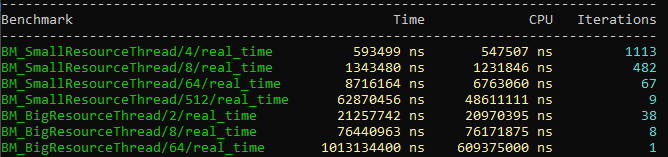

# Blog Seperate Thread Resource Manager
## I. Introduction
I worked on the implementation of a resource manager for a game engine developed in C++.
The purpose of the resource manager is to load the needed files for the conception of the game (scene, prefabs, materials, ...).
Therefore, it contained a map ordering resource with a **ResourceID**.
The **ResourceID** used is a UUIDv4, a unique index coded in 128 bits generate randomly. This **ResourceID** allows users to get a resource much time.
The Resources are **BufferFile**, which it's a char\* and its size and an integrated loading function.
		
```cpp
using ResourceId = sole::uuid;
using Path = std::string_view;

struct LoadPromise {
    BufferFile resource;
    Path path = "";
    bool ready = false;
    LoadPromise(Path newPath) : path(newPath) {}
    LoadPromise() {}
};
struct BufferFile
{
    char* dataBuffer = nullptr;
    size_t dataLength = 0;

    void Load(std::string_view path);
    void Destroy();

    bool operator==(const BufferFile& bufferFile) const;

};
```

For the game engine, we use a **Separate Thread Resource Manager**. It's a resource manager working on a thread parallel to the main thread.
This technique allows a big optimization because it allows loading files without interrupt game thread.
    


Indeed, loading resources is quite a long operation because it requires access to memory.

However, the difficulty with multi-threading is to access the same variable with two threads.

A class **Separate Thread Resource Manager** is composed of 3 critic members :

- **status_** : which allows knowing the status of the resource Manager (Empty, Waiting,...)
- **idQueue_** : which is the queue of **ResourceID** needed to be load
- **resourcePromise_** : which is a map using **ResourceID** as key and contain resources information (resources, path, ready)

```cpp
public:
    std::unordered_map<ResourceId, LoadPromise> resourcePromises_;
    std::vector<ResourceId> idQueue_;
    std::atomic<std::uint8_t> status_;
```
These members are used by 4 functions on different threads :
Calling from main thread :
			
- **LoadResource** : a function asking the path of the resource and return the **ResourceID** allowing to get the resource
- **IsResourceReady** : function allowing to know if a resource is loaded
- **GetResource** : function allowing to get a resource from a **ResourceID** when it loaded
```cpp
public:
    bool IsResourceReady(const ResourceId resourceId);
    neko::BufferFile GetResource(const ResourceId resourceId);
    ResourceId LoadResource(const Path assetPath);
```
Calling from the parallel thread :
- **LoadingLoop** : a loop which loads resources
```cpp
private:
    void LoadingLoop();
```

So, the critical sections can be represented by the diagram below :


As you can see both threads must access to the same values.
To prevent threads from interacting with the same values at the same time, we need to block the threads for each use. The objective is then to block members as little as possible.

## II. LoadResource

The function **LoadResource** is composed of 5 actions :
1. Add a **LoadPromise** for the future resource
2. Add a new **ResourceID** at the end of the queue
3. Notify the threads that a **ResourceID** has been added
4. Set the **status** to not empty
5. Return the **ResourceID**

So parts 1, 2 and 5 need access to critical members.
However, the first optimization is to past the **status** to **atomic**. Indeed, **atomic** is a parameter allowing CPU to access and modify a value at the same time. Therefore, the modification of the **status** not need to lock other thread.
Furthermore, I noted that the creation of a new UUID can take a lot of time. That why I separate it from the push to the queue and took it out of the critical section.
So, only actions 1 and 3 needed to lock other threads.
```cpp

neko::ResourceId neko::ResourceManager::LoadResource(const Path assetPath)
{
    const ResourceId resourceId = sole::uuid4();
    {
        const std::lock_guard<std::mutex> lockGuard(loadingMutex_);
        idQueue_.push_back(resourceId);
        resourcePromises_[resourceId] = LoadPromise(assetPath);
    }
    status_ |= IS_NOT_EMPTY;
    cv_.notify_all();
    return resourceId;
}

```
### Without Optimization


### With Optimization


As you can see, the optimization reduce a lot the critical section (in red) and allow the main thread to work in parallel.

## III. IsResourceReady & GetResource

The function **IsResourceReady** search if a resource is ready and the function **GetResource** will retrieve a resource by its **ResourceID**.
Firstly, I create a resource only when it's ready. However, that implies that I do a **find** which will go through the whole map to check if the **ResourceID** exists. That why I decided to create a **struct LoadPromise** which knows if the resource is ready.


As you can see, the **find** is twice as long as the **ready**

```cpp
bool neko::ResourceManager::IsResourceReady(const ResourceId resourceId)
{
    bool ready;
    {
        const std::lock_guard<std::mutex> lockGuard(loadingMutex_);
        ready = resourcePromises_[resourceId].ready;
    }
    return ready;
}

neko::BufferFile neko::ResourceManager::GetResource(const ResourceId resourceId)
{
    const std::lock_guard<std::mutex> lockGuard(loadingMutex_);
    neko_assert(resourcePromises_[resourceId].ready, "Resource not ready");
    return resourcePromises_[resourceId].resource;
}

```

## IV. LoadingLoop 
This is a loop that will check if the queue is empty. If it's true, it will pause the thread notified. If the queue is not empty, it will do these 4 actions :
1. Get the first ResourceID of the queue
2. Erase this ResourceID from the queue
3. Load the resource of the path register
4. Set the resource as ready

As seen earlier, the loop can access the status_ without needed to be locked. To check if the queue is empty, I preferred to register it in the status_ avoiding to lock the threads.
As seen at the start, the longest part is the loading. So, I can't let the actions 3 in the critical section. That's why I get the struct, unlock threads, load and modify ready, and lock again to set the promise in the map.
        
### Without Optimization


### With Optimization

.

As you can see, when the **LoadingLoop** is not optimize, it lock the main thread during the loading.

##  V. Conclusion

### Without Optimization



### With Optimization


**TODO Remake benchmark**
**TODO Display EsayProfiler**

As you can see, with my optimization, all the critical section are reduce allowing the main thread to run without interruption.

### Lesson learned
This project taught me a lot about the importance of the critical section and how to minimize them.

