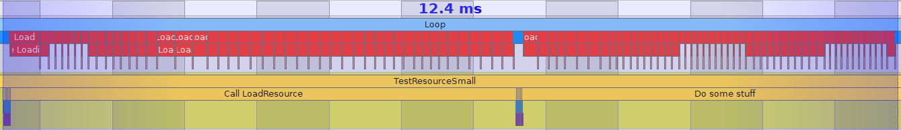
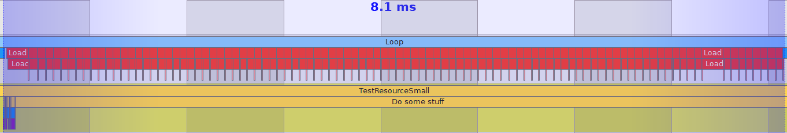

# Blog Infinite Chunks Generation

## Introduction
I’m currently in a Games Programming formation and as part of the module of computer graphics, we are asked to create a Minecraft-Like in C++ using the NekoEngine.
The NekoEngine is a custom c++ engine using SDL 2.0 and OpenGlES 3.0.

One of my tasks was to implement the **infinite chunk generation**.

Our goal was to be able to generate an infinite world horizontally and 256 blocks vertically.


So, we started on the segmentation of the world in chunk of 16 x 16 x 16 blocks.


My chunk generation is composed of 5 actions :
1. Update chunks if they are visible or not
2. Generate new chunk if they are in the view distance
2. Calculate if the new chunks occlude other chunks
3. Calculate if the new chunks is occluded by other chunks
5. Set values to render chunks


All these action will be done in the class **ChunkSystem**.

<a name="UpdateVisibleChunks"></a>
## I. UpdateVisibleChunks
This function is call every Update of the engine. It purpose is to update chunks if they are visible or not, accessible or not, and launch the Job for **GenerateChunkContent** and **CalculateVisibleStatus** of new chunks.

### GetLoadedChunks
For each loaded, if it's not in viewDIst, remove visible and if it's not in accessibleDist, remove accessible.
To know the ChunkStatus, they are all stored inside ChunkStatusManager

```cpp
enum class ChunkFlag: std :: uint16_t
{
EMPTY = 1u << 0u,
ACCESSIBLE = 1u << 1u,
VISIBLE = 1u << 2u,
LOADED = 1u << 3u,
OCCLUDED = 1u << 4u,
}
class ChunkStatusManager final : public ComponentManager<ChunkMask, ComponentType::CHUNK_STATUS>
{
public :
std::vector<Index> GetAccessibleChunks();

std::vector<Index> GetRenderedChunks();

std::vector<Index> GetDirtyChunks();

std::vector<Index> GetLoadedChunks();
}
```
To know the pos, they are all stored inside ChunkPosManager
```cpp
using ChunkPos = Vec3i;
class ChunkPosManager final : public ComponentManager<Vec3i, ComponentType::CHUNK_POS>
{
	Vec3i GetPositon(Entity chunkIndex);

	void SetPositon(Entity chunkIndex, const Vec3i& chunkPos);
	
	Entity GetChunkAtPos(const Vec3i& chunkPos);
};
```
If it's Dirty, I call **UpdateDirtyChunks**.

### CheckVisibleChunks
For each position inside the view distance, I search if the chunk exist.
If not I create a Job to launch the [**GenerateChunkContent**](#GenerateChunkContent) in the other thread.
If the chunk exist, I use the [Frustrum culling of Guillaume]() to know if the chunk is in the view field and set it at visible. If this chunk is in the accessible distance, I will set it accessible.
If the chunk is not in the frustum I remove the status visible and accessible.
Finally the chunk Update look like that.


### CheckGenerationJobs
Finally, I check if all my jobs are done and launch the **CalculateVisibleStatus** for all new chunks.

<a name="GenerateChunkContent"></a>
## II. GenerateChunkContent
This function is always execute in seperate threads. Indeed, the chunk generation is pretty slow (avg **TODO**) and to avoid to freeze the player when a new chunk is generated, it is better to loaded chunk in multi-threading. 
To generate a chunk, I use the chunk position.
### MapGeneration
If the chunk is underground, I fill all the chunks. If the chunk is over the sirface it be empty.
If the chunk is at the surface, I use the [Map Generation of Sebastien]() to generate the ChunkContent.

### ChunkContent
The ChunkContentVector is an ECS component used to store blocks data in chunks. It's a vector of ChunkContent
```cpp
struct ChunkContentVector
{
	std::vector<ChunkContent> blocks;
}
class ChunkContentManager final : public ComponentManager<ChunkContentVector, ComponentType::CHUNK_CONTENT>
{
}
```

Then, for each side of my chunk, I launch **CalculateOcclusionStatus** to know if i can occlude other chunks.
### Set Chunk Informations
As my function is in different thread, I lock all the component managers function of the component used in this thread to avoid race conditions.
So to avoid overlocking my generation, all the informations above are store and I set it now.
First, I set if the chunk status is Empty or not.
Then, I set the Occlusion Status informations.
Finally, I set the ChunkContent informations.

### Set Chunk Informations
In the stored chunk content, I **CalculateBlockOcclusion** to keep only visible blocks of each chunks.
And finally, I set this ChunkContentVector into the ChunkRender in the render thread.

### ChunkRender
The ChunkRender is an ECS component used to store the render data of the chunks. It create OpenGl data of the instance based on the ChunkContentVector. You can check the [Chunk Rendering of Simon]().
```cpp
struct ChunkRender
{
	unsigned vbo = 0;
	gl::RenderCuboid cube{Vec3f::zero, Vec3f::one};
};
class ChunkRenderManager final : public ComponentManager<ChunkRender, ComponentType::CHUNK_RENDER>
{
	void Init(Entity chunkIndex);
	
	void SetChunkValues(const Entity chunkIndex, ChunkContentVector chunkContentVector);
}
```

<a name="CalculateOcclusionBlocks"></a>
## III. CalculateOcclusionBlocks
- When the chunks are generated, check if the chunk occludes the vision of the adjacent blocks.

<a name="CalculateVisibleStatus"></a>
## III. CalculateVisibleStatus 
- For each visible chunk, I check the adjacent chunk and if they are occluded, I will set them as invisible.

<a name="CalculateBlockOcclusion"></a>
## IV. CalculateBlockOcclusion 
- For each block in chunks, I check their is a adjacent block, I will set them as invisible.

<a name="UpdateDirtyChunks"></a>
## VI. UpdateDirtyChunks
- Get the player's chunk, for this, 
- For each chunk in the viewing distance, I will check if the chunk exists.
- If it exists I will set it as visible, otherwise I will add GenerateChunkArray tu the job task. .
- Then, for each visible chunk, I will call the SetChunkOcclusion.


### Without Optimization


### With Optimization


As you can see, when the **LoadingLoop** is not optimized, the main thread needs to wait for the end of the loading to be unlocked.
But when the **LoadingLoop** is optimized, the main thread can work during the loading.

## Conclusion

### Without Optimization



### With Optimization



As you can see, with my optimization, all the critical sections are reduced, allowing the main thread to run without interruption.
This example represents the importance of the optimization of the critical sections.

#### How to go futher
This project taught me a lot about multi-threading and the way to optimize it with the critical sections.

#### Lesson learned
This project taught me a lot about multi-threading and the way to optimize it with the critical sections.
