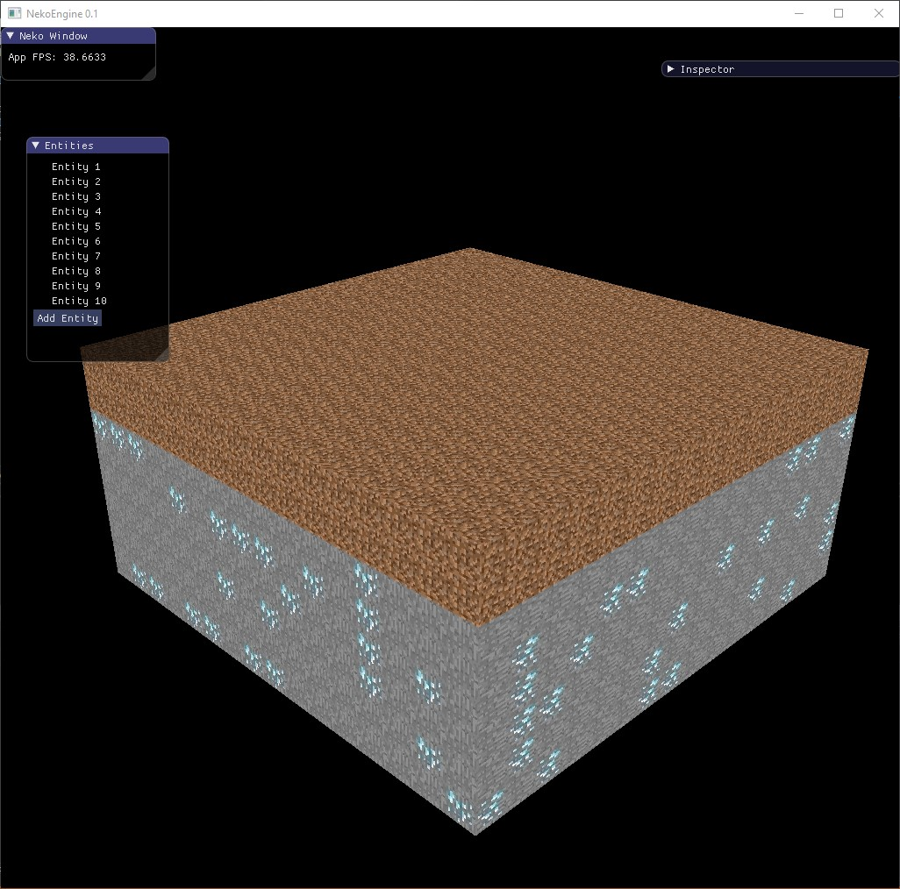
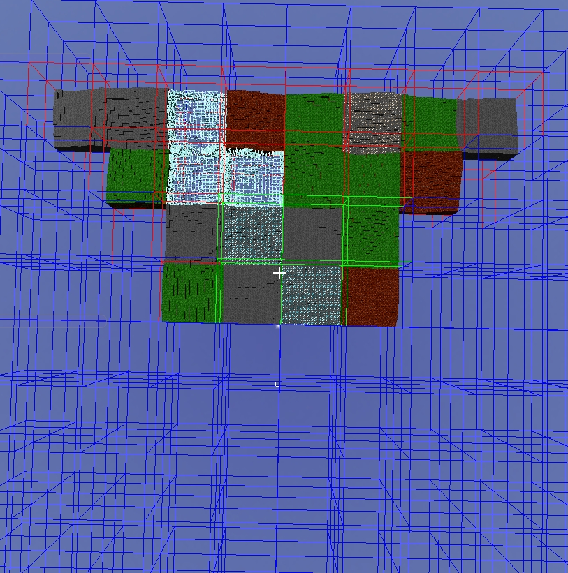
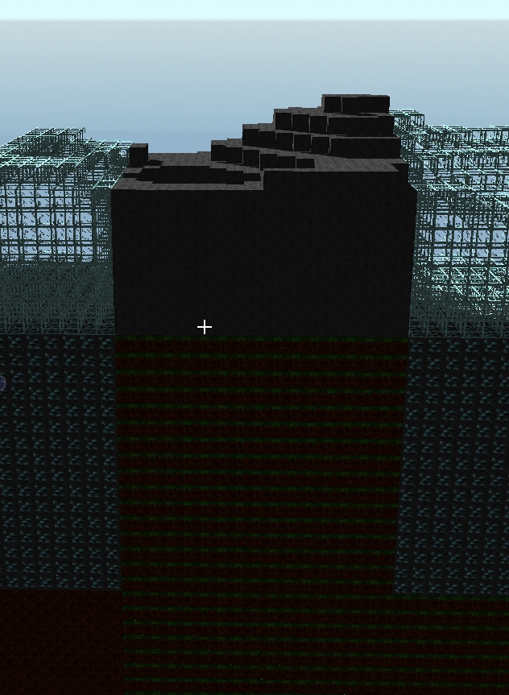
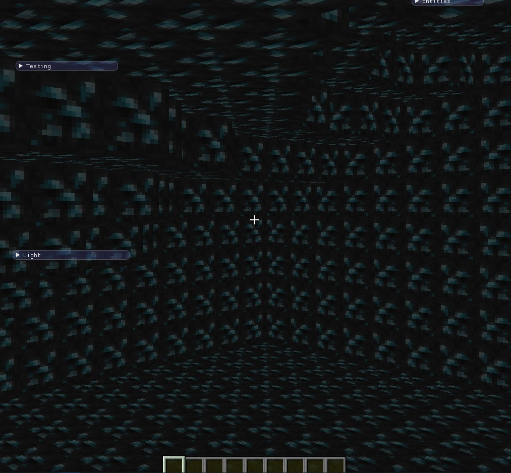
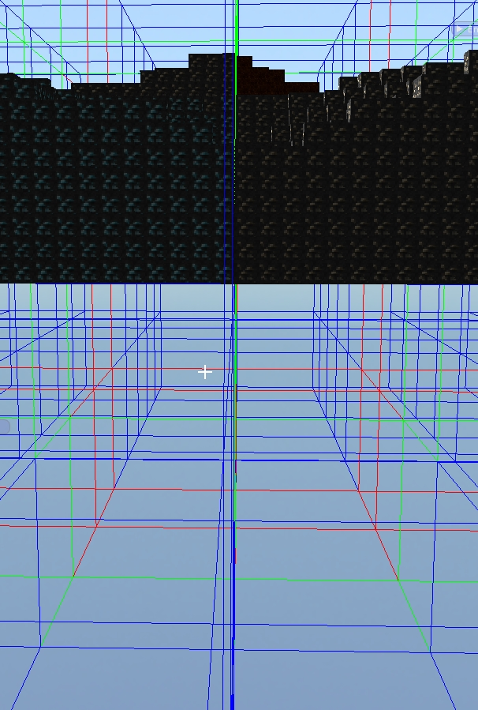
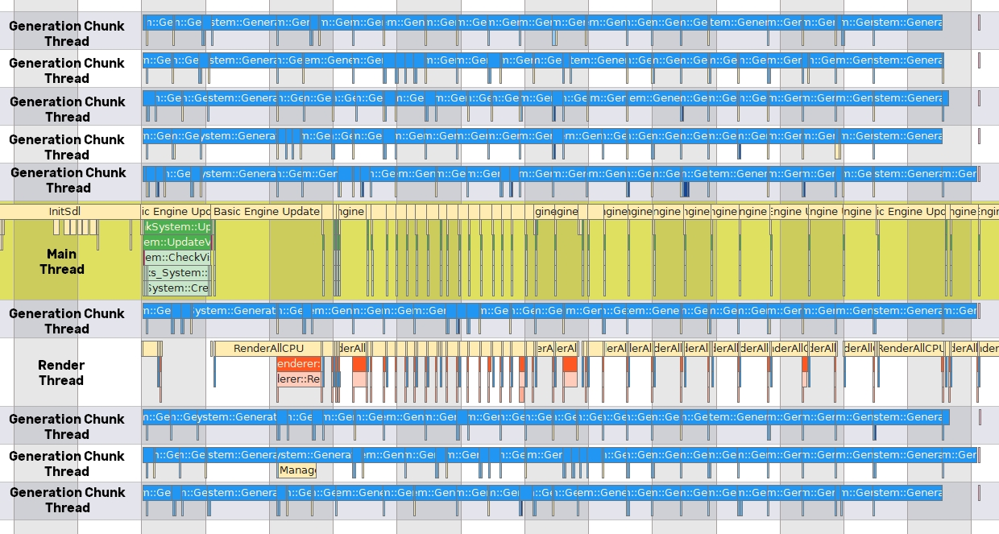

# Blog Infinite Chunks Generation

## Introduction
I’m currently in a Games Programming formation and as part of the module of computer graphics, we are asked to create a Minecraft-like in C++ using the NekoEngine.
The NekoEngine is a custom C++ Engine using SDL 2.0 and OpenGL ES 3.0. 

One of my tasks was to implement the **infinite chunk generation**.

Our goal was to be able to generate an infinite world horizontally and 64 blocks vertically.

So, we started on the segmentation of the world in a chunk of 16 x 16 x 16 blocks.



My chunk generation is composed of 6 actions :
1. Update chunks if they are visible or not
2. Generate new chunk if they are in the view distance
3. Calculate if the blocks are occluded by other blocks
2. Calculate if the new chunks occlude other chunks
3. Calculate if the new chunks are occluded by other chunks
5. Recalculate if a chunk is occluded or can occlude when the chunk has been modified

All these actions will be done in the class **ChunkSystem**.

<a name="UpdateVisibleChunks"></a>
## I. UpdateVisibleChunks
This function is called every Update of the engine. Its purpose is to update chunks if they are visible or not, accessible or not, and launch the Job for **GenerateChunkContent** and **CalculateVisibleStatus** of new chunks.

### Get Loaded Chunks
For each chunk loaded, if it's not in the view distance, it removes the visible status and if it's not in the accessible distance, it removes the accessible status.
The ChunkStatus is an ECS component, it is a bitmask used to store the status of the chunks. They are all stored inside ChunkStatusManager.
```cpp
using ChunkMask = std::uint16_t;
enum class ChunkFlag: std :: uint16_t
{
EMPTY = 1u << 0u,
ACCESSIBLE = 1u << 1u,
VISIBLE = 1u << 2u,
LOADED = 1u << 3u,
OCCLUDED = 1u << 4u,
}
class ChunkStatusManager final : public ComponentManager<ChunkMask, ComponentType::CHUNK_STATUS>
{
public :
std::vector<Index> GetAccessibleChunks();

std::vector<Index> GetRenderedChunks();

std::vector<Index> GetDirtyChunks();

std::vector<Index> GetLoadedChunks();
}
```
The ChunkPos is also an ECS component, it is a Vector3<int> used to store the position of the chunks. They are all stored inside ChunkPosManager.
```cpp
using ChunkPos = Vec3i;
class ChunkPosManager final : public ComponentManager<Vec3i, ComponentType::CHUNK_POS>
{
	Vec3i GetPositon(Entity chunkIndex);

	void SetPositon(Entity chunkIndex, const Vec3i& chunkPos);
	
	Entity GetChunkAtPos(const Vec3i& chunkPos);
};
```
If the chunk is dirty, I call **UpdateDirtyChunks**.

### CheckVisibleChunks
For each position inside the view distance, it searches if the chunk already exists.
If not, it creates a Job to launch the **GenerateChunkContent** in the other thread.
If the chunk exists, it uses the [Frustrum culling of Guillaume](https://gjeannin0.github.io/) to know if the chunk is in the view field and set it visible. If this chunk is in the accessible distance, I will set it accessible.
If the chunk is not in the frustum it removes the status visible and accessible.
Finally, the chunk status looks like that.


> Without frustum


> With frustum

> Caption : Green = ACCESSIBLE; RED = VISIBLE; BLUE = LOADED

### CheckGenerationJobs
Finally, it checks if all my jobs are done and launch the **CalculateVisibleStatus** for all new chunks.

<a name="GenerateChunkContent"></a>
## II. GenerateChunkContent
This function is always executed in separate threads. Indeed, the chunk generation is pretty slow (33ms/chunk) and, to avoid to freeze the player when a new chunk is generated, it is better to loaded chunk in multi-threading. 
To generate a chunk, it uses the chunk position.
### MapGeneration
If the chunk is underground, it fills all the chunks. If the chunk is over the surface, it will be empty.
If the chunk is at the surface, it uses the [Map Generation of Sebastien](https://sebastienfeser.github.io/) to generate the ChunkContent.


> Slice of map generation without occlusion

### ChunkContent
The ChunkContentVector is an ECS component used to store blocks data in chunks. It's a vector of ChunkContent
```cpp
struct ChunkContentVector
{
	std::vector<ChunkContent> blocks;
	
	void CalculateBlockOcclusion();
}
class ChunkContentManager final : public ComponentManager<ChunkContentVector, ComponentType::CHUNK_CONTENT>
{
}
```

Then, for each side of the chunk, it launch **CalculateOcclusionStatus** to know if it can occlude other chunks.
### Set Chunk Data
As my function is in different threads, it locks all the component manager's functions of the components used in this thread to avoid race conditions.
So to avoid overlocking my generation, all the data above are store and I set it now.
First, it set if the chunk status is empty or not.
Then, it set the occlusion status data.
Finally, I set the ChunkContent data.

### Set Render Data
In the stored chunk content, it calls **CalculateBlockOcclusion** to keep only visible blocks of each chunk.
And finally, it set this ChunkContentVector into the ChunkRender in the render thread.

### ChunkRender
The ChunkRender is an ECS component used to store the render data of the chunks. It creates OpenGL data of the instance based on the ChunkContentVector. For more information, you can check the [Chunk Rendering of Simon](https://canassimon.github.io/blog/programming/2020/07/20/chunk-rendering).
```cpp
struct ChunkRender
{
	unsigned vbo = 0;
	gl::RenderCuboid cube{Vec3f::zero, Vec3f::one};
};
class ChunkRenderManager final : public ComponentManager<ChunkRender, ComponentType::CHUNK_RENDER>
{
	void Init(Entity chunkIndex);
	
	void SetChunkValues(const Entity chunkIndex, ChunkContentVector chunkContentVector);
}
```

<a name="CalculateOcclusionBlocks"></a>
## III. CalculateBlockOcclusion
This function is call by the **UpdateDirtyChunks** and the **GenerateChunkContent**. Its purpose is to calculate the occlusion of each block of the ChunkContentVector.
The function is pretty simple, for each block, if there is not another block on each side, it will set it visible.


> Chunk with block occlusion

<a name="CalculateVisibleStatus"></a>
## III. CalculateOcclusionStatus 
This function is also call by the **UpdateDirtyChunks** and the **GenerateChunkContent**. Its purpose is to calculate if a chunk can occlude another chunk.

### Chunk Oclussion Status
The chunk occlusion status is store inside the ChunkStatus. It used to know if a side of a chunk can occlude its neighbor.
```cpp
enum class ChunkFlag: std :: uint16_t
{
OCCLUDE_DOWN = 1u << 4u,
OCCLUDE_UP = 1u << 5u,
OCCLUDE_RIGHT = 1u << 6u,
OCCLUDE_LEFT = 1u << 7u,
OCCLUDE_FRONT = 1u << 8u,
OCCLUDE_BACK = 1u << 9u,
}
```

### Chunk Side Check
First, if a chunk is empty, the function returns false because it can't occlude another chunk and if a chunk is full, the function returns true because it always occludes another chunk.
Then, I check all the side, if the side if full of block it returns true because the side occludes the neighbor chunk, else it returns false.


<a name="CalculateBlockOcclusion"></a>
## IV. CalculateVisibleStatus 
This function is also call by the **UpdateDirtyChunks** and the separate thread by the **UpdateVisibleChunks**. Indeed, this function can be run in another thread because it will online affect invisible chunks.
Indeed, its purpose is to calculate if a chunk is occluded by another chunk.
That's why, this function must be called after the **CalculateOcclusionStatus** because it will use the occlusion data of the other chunks.

### Check neighbor occlusion
For each side of the chunks, this function will get the neighbor ChunkStatus. If all the neighbors are occluded or if their side occludes the chunk, the chunk will be occluded.


> Slice of map generation with occlusion

<a name="UpdateDirtyChunks"></a>
## V. UpdateDirtyChunks
This function is only called by the **UpdateVisibleChunks** because its purpose is to recalculate chunk if a chunk is occluded or can occlude when the chunk has been modified.
### Chunk Dirty Status
The ChunkStatus Dirty is set by the PlayerController when a block is placed or break. It used to recalculate if a chunk is occluded or can occlude.
```cpp
enum class ChunkFlag: std :: uint16_t
{
	DIRTY = 1u << 11u;
}
```
### Reset Block Occlusion
First, it recalculates the block occlusion of the chunk with **CalculateBlockOcclusion**.
And then, it set this ChunkContentVector into the ChunkRender in the render thread.

### Check Chunk Occlusion Status
For each side of the chunk, it calculates the occlusion status using **CalculateOcclusionStatus**. If the calculated occlusion status is different from the stored status, it will set or remove the occlusion status.
Then, it gets the chunk next to the modified side and call **CalculateVisibleStatus** for the neighbor chunk.
Finally, if remove the dirty status.


> Example of occluded chunks generate when blocks are break

## Results


## Performance




> On Windows10, Intel(R) Core(TM) i7-8750H CPU @2.20GHz, NVIDIA GeForce GTX 1060 with MSVC v16.5

- First 256 chunks take 1319 ms to be generate in 9 threads
- On average, the generation of new chunks takes 33 ms
- UpdateVisibleChunk take 1.6 ms each update
- Breaking a block and update chunk take 13 ms

## Conclusion
Using my chunk generation, I optimize the generation and the rendering of our Minecraft-like thanks to Chunks Occlusion, Blocks Occlusion and Frustum Culling. 

#### How to go futher
You can use of IDs for chunks greatly facilitated by the decision to set up a finite world

#### Lesson learned
This project taught me a lot about the importance of good data management.

