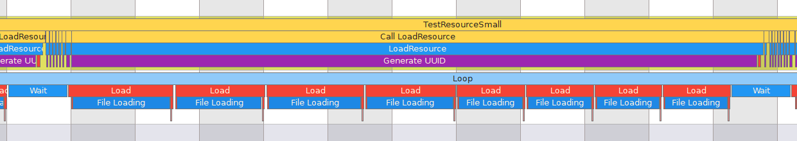

# Blog Infinite Chunks Generation

## Introduction
I’m currently in a Games Programming formation and as part of the module of computer graphics, we are asked to create a Minecraft-Like in C++ using the NekoEngine.
The NekoEngine is a custom c++ engine using SDL 2.0 and OpenGlES 3.0.

One of my tasks was to implement the **infinite chunk generation**.

Our goal was to be able to generate an infinite world horizontally and 256 blocks vertically.


So, we started on the segmentation of the world in chunk of 16 x 16 x 16 blocks.


My chunk generation is composed of 5 actions :
1. Update chunks if they are visible or not
2. Generate new chunk if they are in the view distance
2. Calculate if the new chunks occlude other chunks
3. Calculate if the new chunks is occluded by other chunks
5. Set values to render chunks


All these action will be done in the class **ChunkSystem**

## I. UpdateVisibleChunks


## II. GenerateChunkContent

The function **IsResourceReady** searches if a resource is ready and the function **GetResource** will retrieve a resource by its **ResourceID**.
Firstly, I create a resource only when it's ready. However, that implies that I do a **find** which will go through the whole map to check if the **ResourceID** exists. That's why I decided to create a **struct Resource** which knows if the resource is ready.


As you can see, the **find** is twice as long as the **ready**.

```cpp
bool neko::ResourceManager::IsResourceReady(const ResourceId resourceId)
{
    bool ready;
    {
        const std::lock_guard<std::mutex> lockGuard(loadingMutex_);
        ready = resourcePromises_[resourceId].ready;
    }
    return ready;
}

neko::BufferFile neko::ResourceManager::GetResource(const ResourceId resourceId)
{
    const std::lock_guard<std::mutex> lockGuard(loadingMutex_);
    neko_assert(resourcePromises_[resourceId].ready, "Resource not ready");
    return resourcePromises_[resourceId].data;
}
```

## III. CalculateOcclusionStatus 

This is a loop that will check if the **idQueue** is empty. If it's true, it will pause the thread waiting to be notified. If the **idQueue** is not empty, it will do these 4 actions :
1. Get the first **ResourceID** of the **idQueue**
2. Erase this **ResourceID** from the **idQueue**
3. Load the resource of the saved path
4. Set the resource as **ready**

As seen earlier, the loop can access the **status** without needing to be locked. To check if the **idQueue** is empty, I preferred to save it in the **status** avoiding to lock the threads.
As seen at the start, the longest part is the loading. So, I can't let the actions 3 in the critical section. That's why I first get the **Resource**, then unlock threads, **Load** and modify **ready**, and  finally lock again to set the **Resource** in the map.
        

```cpp
void neko::ResourceManager::LoadingLoop()
{
    while (status_ & IS_RUNNING) 
    {
        if (status_ & IS_NOT_EMPTY) 
        {
            ResourceId resourceToLoad;
            Resource resource;
            {
                std::lock_guard<std::mutex> lockGuard(loadingMutex_);
                resourceToLoad = idQueue_[0];
                promise = resourcePromises_[resourceToLoad];
            }
            resource.data.Load(promise.path);
            resource.ready = true;

            {
                std::lock_guard<std::mutex> lockGuard(loadingMutex_);
                resourcePromises_[resourceToLoad] = resource;
                idQueue_.erase(idQueue_.begin());
                if (idQueue_.empty())
                {
                    status_ &= ~IS_NOT_EMPTY;
                }
            }
        } else 
        {
            std::unique_lock<std::mutex> lock(loadingMutex_);
            if (!(status_ & IS_NOT_EMPTY))
            {
                cv_.wait(lock);
            }
        }
    }
}

```

## III. CalculateVisibleStatus 


## IV. CalculateBlockOcclusion 

## V. SetChunkValues 

## VI. UpdateDirtyChunks


### Without Optimization



### With Optimization


As you can see, when the **LoadingLoop** is not optimized, the main thread needs to wait for the end of the loading to be unlocked.
But when the **LoadingLoop** is optimized, the main thread can work during the loading.

## Conclusion

### Without Optimization


### With Optimization


As you can see, with my optimization, all the critical sections are reduced, allowing the main thread to run without interruption.
This example represents the importance of the optimization of the critical sections.

#### How to go futher
This project taught me a lot about multi-threading and the way to optimize it with the critical sections.

#### Lesson learned
This project taught me a lot about multi-threading and the way to optimize it with the critical sections.

